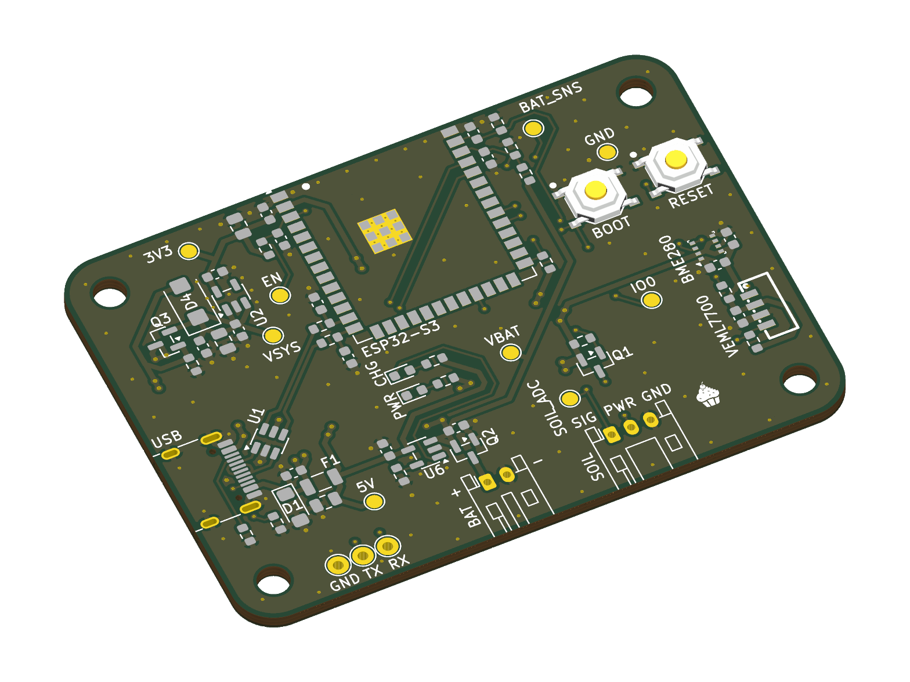
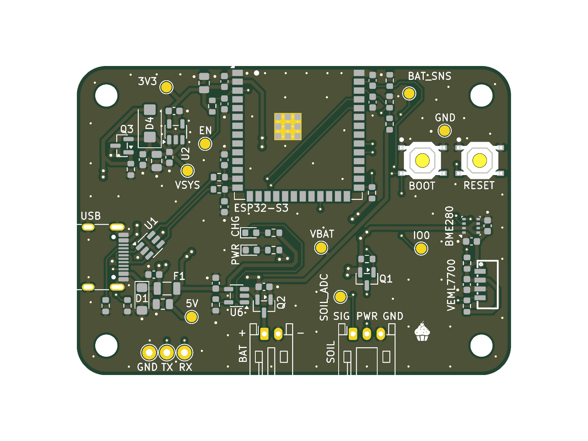
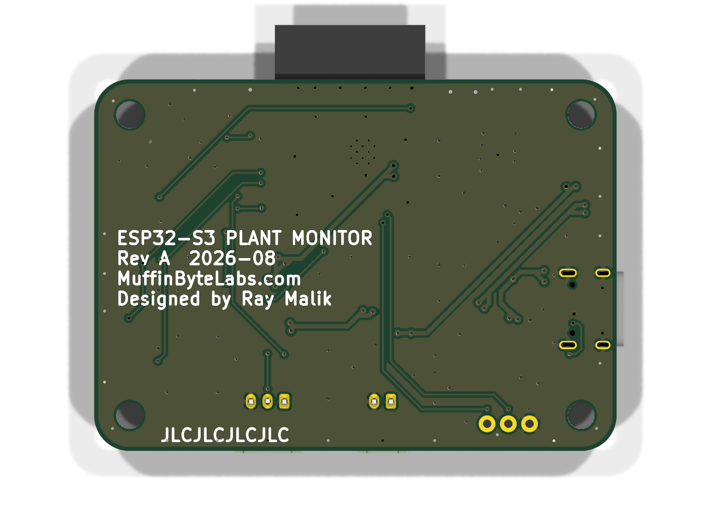

# ESP32-S3 Plant Monitor — Rev A

**Ray Malik** · [muffinbytelabs.com](https://muffinbytelabs.com) · [muffinbytelabs@gmail.com](mailto:muffinbytelabs@gmail.com)

A solo hardware project taken the whole way: requirements → schematic capture → 4-layer layout → DFM → fab and assembly order → bring-up. Every schematic, review, waiver and decision in this repo is my own work.

Wi-Fi plant monitor: soil moisture, temperature / humidity / pressure, and ambient light, USB-C powered with 1-cell LiPo charging and automatic USB↔battery hand-over. Native-USB programming, no bridge chip. KiCad 10 hierarchical schematic, **4-layer board** (signal / GND / GND / signal, JLC04161H-7628), 62.5 × 44.5 mm, ordered fabricated and assembled at JLCPCB on **2026-08-21**.

*KiCad 3D render. Rev A was ordered fabricated **and assembled** at JLCPCB on 2026-08-21 and is in production — photographs of the populated board and measured bring-up results will be published here when it lands.*

**Status — Rev A ordered 2026-08-21.** 5 boards, 4-layer, fully assembled by JLCPCB. DRC at order: **0 errors · 0 unconnected items · 0 schematic-parity differences** (KiCad 10.0.5, zones refilled). Next step is bring-up per [`docs/BringUp_Guide.md`](docs/BringUp_Guide.md).

| | |
|---|---|
| **MCU** | ESP32-S3-WROOM-1-N8, native USB — no bridge chip |
| **Sensors** | BME280 (temperature / humidity / pressure) · VEML7700 (ambient light) · DFRobot SEN0193 capacitive soil probe |
| **Power** | USB-C 5 V → PPTC + TVS → AP2112K-3.3 (600 mA) · MCP73831 1S LiPo charger · discrete USB↔battery load share, hand-over in ≈50–100 ms |
| **Sleep** | ≈210 µA as built (≈90 µA with the power LED unfitted) ⇒ ~100 days on a 500 mAh cell |
| **Board** | 62.5 × 44.5 mm · 4-layer, JLC04161H-7628 · 1.6 mm · lead-free HASL · 404 track segments, 154 vias |
| **Verification** | 6 written reviews · 20 packages / 69 placements checked against datasheets |
| **Built** | 5 boards fabricated + assembled for ≈$49 after coupons, every part pre-stocked in the JLC library |
| **Tools** | KiCad 10 · JLCPCB Standard PCBA |

## Start here

Everything below opens in the browser — no KiCad install, no downloads.

| | |
|---|---|
| 📐 **[Schematic (PDF, 8 sheets)](docs/ESP32S3_PlantMonitor_RevA_Schematic.pdf)** | The whole design, plotted from the board file that was ordered |
| 📄 **[Design document](docs/ESP32S3_Plant_Monitor_Final_Design_Document.md)** | Every component and why it is there, written to be read by someone who is not a PCB engineer |
| 🔍 **[Design reviews — 6 on file](docs/reviews/)** | Real review records with findings, severities and fixes. The pre-fab review caught **3 blocking errors** — floating USB-C ground pins, a missing battery-sense chain, and a stale BOM — all resolved before ordering |
| 🧭 **[What I'd change in Rev B](docs/RevB_Upgrade_Plan.md)** | Ranked upgrades with a three-way charger-IC comparison and a costed path from 210 µA to 15–35 µA |
| 🧪 **[Engineering notes](docs/Engineering_Notes.md)** | Bench measurements: soil calibration, the three-layer battery-protection analysis, the hand-over walkthrough |
| 🏭 **[Frozen manufacturing package](fabrication/revA/)** | The exact gerber zip, BOM and CPL uploaded to JLCPCB, beside [`ORDER_NOTES.md`](fabrication/revA/ORDER_NOTES.md) — every setting the board was ordered with |
| 🔧 **[Bring-up guide](docs/BringUp_Guide.md)** | First-power procedure, expected voltages, probe points, troubleshooting |
| 🖨 **[Fab layer plots (PDF)](docs/ESP32S3_PlantMonitor_RevA_FabLayers.pdf)** | All four copper layers, both silks, mask and paste — what the fab actually receives |

| Top | Bottom |
|---|---|
|  |  |

## What this board demonstrates

- **4-layer discipline** — dual unbroken ground planes, zero signals on the inner layers, a via at every decoupler, stitching around the antenna keep-out.
- **RF module integration** — antenna nose overhanging the board edge, all-layer keepout, ground ring, and a panel-rail instruction written into the fab remark so breakaway tabs cannot sit under the overhang.
- **USB 2.0 pair** at ≈90 Ω coupled geometry, length-matched, no vias, ESD in copper order.
- **Power-path design with numbers** — fuse → TVS → LDO, an automatic USB↔battery hand-over sized so the switch completes in ≈50–100 ms, and a 210 µA sleep budget with a named dominant contributor.
- **Manufacturing fluency** — DFM checked against JLCPCB's live capability pages, part-tier economics understood before ordering, pre-stocked parts library, DDP tariff handling.
- **A documentation trail** — two design reviews, a placement review, a finishing review, a final layout audit, and order notes, all on record here.

## What I'd change in Rev B

- **The power path is discrete, and it shows.** MCP73831 + Schottky + P-FET load-sharing works, but it has a ≈50–100 ms body-diode notch at USB unplug, a Vgs-dependent switch point, and no charge safety timer. Rev B replaces the four-part cluster with one IC — [BQ24075 vs MCP73871 vs TPS2113A, compared](docs/RevB_Upgrade_Plan.md#1-integrated-power-path-the-headline-upgrade).
- **210 µA of sleep current is too high**, and the power LED alone is 120 µA of it. LED on a solder jumper, a nanopower LDO, and a switched sense divider get it to 15–35 µA — months to years of standby instead of weeks.
- **No series element on the soil-probe ADC input.** The probe cable is a metre-long antenna into a bare pin; Rev A has only a parallel pull-down. Series resistor plus TVS at J2 next time.
- **Four layers were bought for margin, not for speed.** The fastest signal on this board is USB Full Speed — a disciplined 2-layer board would have worked. The reasoning for spending the extra layers is written down in [`docs/KiCad_Settings_RevA.md`](docs/KiCad_Settings_RevA.md).

<strong>Repository map</strong> — 24 documents, KiCad sources, frozen fab package, datasheets

| Path | What |
|---|---|
| [`hardware/`](hardware/) | KiCad 10 project — root sheet + sheets 02–08, libraries in `hardware/libs/`. Library paths are `${KIPRJMOD}`-relative; keep `libs/` inside `hardware/`. |
| [`fabrication/revA/`](fabrication/revA/) | The frozen order package: gerber zip, BOM, CPL, and `ORDER_NOTES.md` (§7 = the as-ordered record) |
| **Documents** | |
| [`docs/ESP32S3_PlantMonitor_RevA_Schematic.pdf`](docs/ESP32S3_PlantMonitor_RevA_Schematic.pdf) | All 8 schematic sheets, plotted from the ordered board file |
| [`docs/ESP32S3_PlantMonitor_RevA_FabLayers.pdf`](docs/ESP32S3_PlantMonitor_RevA_FabLayers.pdf) | Layer-by-layer fab plots |
| [`docs/ESP32S3_Plant_Monitor_Final_Design_Document.md`](docs/ESP32S3_Plant_Monitor_Final_Design_Document.md) | The full design document — as-built designators throughout; Addendum A holds the renumbering record |
| [`docs/PROJECT_STATUS.md`](docs/PROJECT_STATUS.md) | Rev A order and build log: what was ordered, what it cost, order-day problems and fixes, waivers on record |
| [`docs/BringUp_Guide.md`](docs/BringUp_Guide.md) | First-power procedure, expected voltages, probe points |
| [`docs/PinMap_CheatSheet.md`](docs/PinMap_CheatSheet.md) | GPIO / net / connector map, as built |
| [`docs/Engineering_Notes.md`](docs/Engineering_Notes.md) | Bench notes: calibration values, battery-protection analysis, hand-over walkthrough |
| [`docs/ESP32S3_PlantMonitor_RevA_BOM.md`](docs/ESP32S3_PlantMonitor_RevA_BOM.md) | BOM as a readable table (the [`.xlsx`](docs/ESP32S3_PlantMonitor_RevA_BOM.xlsx) is the editable source) |
| **Layout rulebooks** | |
| [`docs/Hard_Rules_Layout_RevA.md`](docs/Hard_Rules_Layout_RevA.md) | The graded rulebook — LAW vs STRONG PRACTICE, plus 4-layer amendments |
| [`docs/Routing_Guide_RevA_4Layer.md`](docs/Routing_Guide_RevA_4Layer.md) | Layer strategy, net-by-net routing order, via craft |
| [`docs/KiCad_Settings_RevA.md`](docs/KiCad_Settings_RevA.md) | Every board-setup value and the reasoning behind it |
| [`docs/Layout_Readiness_and_Placement_Guide_RevA.md`](docs/Layout_Readiness_and_Placement_Guide_RevA.md) | Footprint verification + placement playbook |
| [`docs/Footprint_Check_ESP32S3_PlantMonitor_RevA.md`](docs/Footprint_Check_ESP32S3_PlantMonitor_RevA.md) | All 20 packages / 69 placements, each checked against its datasheet |
| [`docs/Footprint_Terms_and_Leeway_Guide.md`](docs/Footprint_Terms_and_Leeway_Guide.md) | Plain-English footprint terms and how much tolerance actually matters |
| [`docs/Fabrication_File_Primer.md`](docs/Fabrication_File_Primer.md) | What each gerber and drill file is, and why |
| [`docs/Finishing_Guide_RevA.md`](docs/Finishing_Guide_RevA.md) | Silkscreen, branding and pre-order finishing pass |
| [`docs/RevB_Upgrade_Plan.md`](docs/RevB_Upgrade_Plan.md) | Ranked upgrades, integrated power path first |
| **Reviews** | |
| [`docs/reviews/`](docs/reviews/README.md) | All six reviews, [indexed here](docs/reviews/README.md) with date, scope, method and outcome |
| **References** | |
| [`references/datasheets/`](references/datasheets/) | Vendor datasheets for every part — [indexed here](references/datasheets/README.md) |
| [`references/JLCPCB_Capabilities_2026-08.md`](references/JLCPCB_Capabilities_2026-08.md) | Capability quick-sheet used for DFM |
| [`references/reference-designs/`](references/reference-designs/) | Espressif DevKitC-1 schematic |
| [`firmware/`](firmware/) | The hardware→firmware contract: thresholds, sequences and pin duties the board imposes |

## What's next

Boards arrive early September. Bring-up follows [`docs/BringUp_Guide.md`](docs/BringUp_Guide.md) — measured results go into its record sheet, and a photograph of the working board replaces the render above.

Questions, or hiring: **[muffinbytelabs@gmail.com](mailto:muffinbytelabs@gmail.com)** · [muffinbytelabs.com](https://muffinbytelabs.com)

## License

Hardware design files and documentation are released under the **CERN Open Hardware Licence v2 — Permissive** (see [`LICENSE`](LICENSE)). Vendor datasheets in `references/datasheets/` remain the property of their respective manufacturers and are included for convenience only.

## Safety notes for anyone building this board

1. **Meter the battery plug polarity** before it ever touches J3 — the charge LED is not proof of polarity.
2. **Protected cells only**, and never store the board with a battery attached (≈210 µA sleep floor).
3. **Firmware enforces the battery limits**: no Wi-Fi TX below ~3.5 V, deep sleep at 3.0 V.
