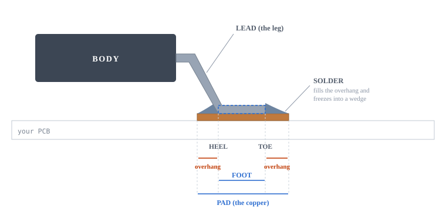
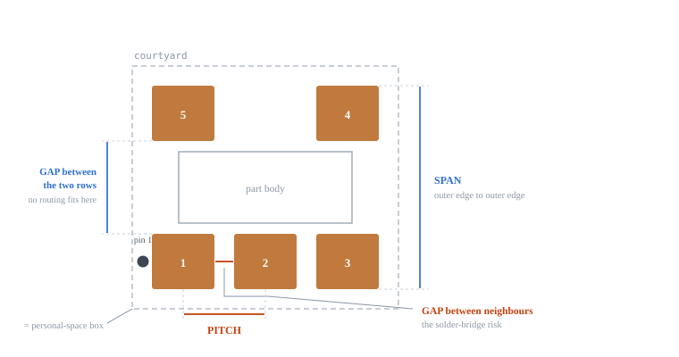
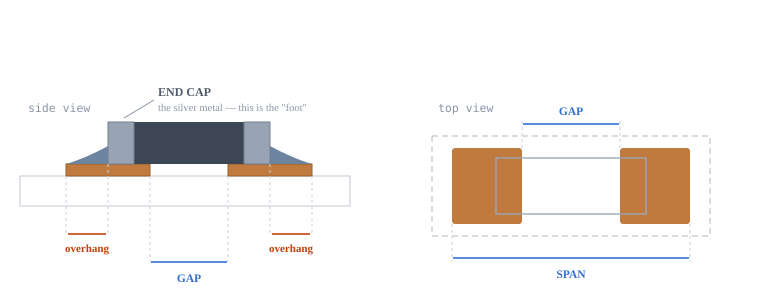
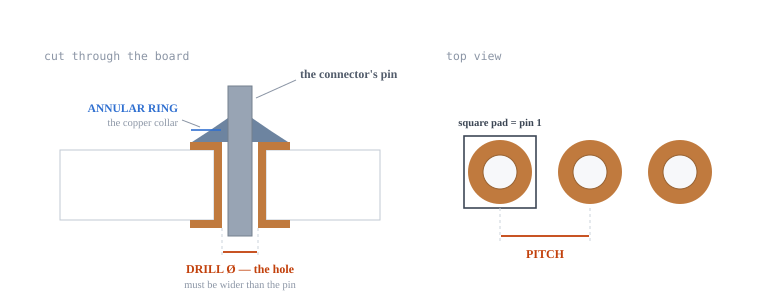

# Footprint terms & how much leeway I actually have

Written for the ESP32-S3 Plant Monitor Rev A footprint check. No jargon assumed — every term is defined with a picture the first time it appears.

The one thing to remember

A footprint is not trying to copy the datasheet drawing. It is trying to make sure **every piece of metal on the part lands on copper, with a little copper sticking out past each end.**

That's what the solder needs. Most of the numbers in a datasheet's suggested layout are one designer's way of achieving that — there are many valid ways. Only a few numbers are actually load-bearing, and this page tells me which.

## 1 The words, with pictures

Start here. Everything else on the page uses these five or six words.

### A part with legs (my SOT-23 parts: the LDO, the charger, the MOSFETs, the ESD chip)



*One leg, seen from the side. The leg bends down out of the body and flattens out — that flat bit is the **foot**. The copper **pad** underneath is longer than the foot, so there's bare copper poking out at each end. Molten solder runs into those gaps and freezes into a wedge. That wedge is the joint.*

- **Pad** — One rectangle of copper on my board. Also called a *land*. — *The metal shape I'm measuring in KiCad.*
- **Footprint** — The whole set of pads for one part, plus its outline and courtyard. — *What I pick in KiCad. It's a pattern, not a part.*
- **Lead** — One leg of the part. — *Just "the leg".*
- **Foot** — The flat underside of the leg — the only bit that actually touches copper. — *Like a human foot: the flat part on the ground.*
- **Heel** — The end of the foot closest to the body. — *Same as my heel — the back.*
- **Toe** — The far tip of the foot, pointing away from the body. — *Same as my toes — the front.*
- **Fillet** — The wedge of solder that forms in the overhang past the heel or toe. — *The bead of solder I can see around a good joint.*

**Why anyone cares about heel vs toe:** the heel wedge is the strong one — it's the part inspectors X-ray and the part that survives being dropped. A pad biased toward the heel (like KiCad's) makes a mechanically stronger joint. A pad biased toward the toe (like Microchip's) makes a joint that's easier to see with a camera. Both work. That's the whole disagreement I found on the SOT-23-5.

### Looking down from above — the words for spacing



*The same part from above (this is a SOT-23-5, like my AP2112K and MCP73831). Red = the two dimensions that can actually break a board. Blue = the ones with room to move.*

- **Pitch** — The centre-to-centre distance between two neighbouring pads in the same row. — *Fence-post spacing. How far apart the legs are.*
- **Gap** — The bare board *between* two pads. Two kinds matter: between side-by-side neighbours, and between the two rows. — *The empty space. Too small = solder bridges two legs together.*
- **Span** — Total distance across, outer edge to outer edge. — *How wide the whole pad group is.*
- **Courtyard** — An invisible box on its own layer saying "keep other parts out of here." — *Personal space. It doesn't get manufactured — it's just KiCad reminding me not to crowd things.*

### Parts with no legs — my resistors, capacitors, LEDs, fuse



*A chip resistor or capacitor has no legs — just a silver metal cap wrapped around each end. Everything works the same: the cap is the "foot", and the pad has to reach under it *and* poke out past it. There's only one gap to worry about, and no pitch at all.*

### Through-hole parts — my two JST battery / sensor connectors



*Through-hole is the one place where a number is a genuine physical limit: **the hole has to be bigger than the pin.** No solder fillet can save me from a hole that's too small — the connector simply will not go in. This is exactly why the Ø0.75 mm drill on my two JST connectors is flagged in the checklist.*

## 2 See it firsthand

*In the original HTML this was an interactive demo: a fixed component foot on a copper pad I could
stretch, shrink and slide, with a live verdict. The foot is **0.45 mm** long and never moves — only
the copper underneath changes. The presets it offered are below, with the same verdict the demo
would have shown.*

The number that decides everything is the **worst-end margin** — how much copper sticks out past the
tighter end of the foot:

```
margin = pad_length / 2 − |offset| − foot_length / 2
```

| Preset | Pad length | Offset | Worst-end margin | Verdict |
|---|---|---|---|---|
| Microchip's SOT-23-5 pad | 1.1 mm | +0.00 mm | +0.325 mm | **GOOD** — copper past both ends with room to spare |
| KiCad's SOT-23-5 pad | 1.325 mm | -0.26 mm | +0.177 mm | **GOOD** — copper past both ends with room to spare |
| Much longer pad | 1.6 mm | +0.00 mm | +0.575 mm | **GOOD** — copper past both ends with room to spare |
| Pad too short | 0.4 mm | +0.00 mm | -0.025 mm | **BROKEN** — metal hangs off the copper; no room for a solder wedge on that side |
| Pad shifted too far | 1.1 mm | +0.38 mm | -0.055 mm | **BROKEN** — metal hangs off the copper; no room for a solder wedge on that side |

Notice what I can and can't break. Making the pad **longer** never breaks it — the "much longer
pad" is as sound as the datasheet's own. Making it much **shorter**, or **sliding it sideways**,
does, because one end of the metal ends up hanging off the copper. That asymmetry is the whole
reason pad length has leeway and pitch doesn't.

Note the second row: KiCad's SOT-23-5 pad is a different length *and* offset from Microchip's
recommendation, and still lands comfortably in GOOD. Two different drawings, one working joint —
which is the point of this whole page.

## 3 What's strict, what's loose

Every dimension I'll measure falls into one of these three buckets.

### EXACT Must match the datasheet, no tolerance

These are the ones where "close enough" isn't a thing. If one of these is wrong, stop and fix it before I do anything else.

|                                                            |                                                                                                                                                                                                                                                |
|------------------------------------------------------------|------------------------------------------------------------------------------------------------------------------------------------------------------------------------------------------------------------------------------------------------|
| Pitch                                                      | Small errors **add up** along the row. Off by 0.05 mm and by the fifth leg I'm off 0.20 mm — leg 3 lands fine and leg 1 misses entirely. There is no such thing as "roughly the right pitch."                                               |
| Number of pads                                             | Self-explanatory, but worth a glance — a SOT-23-5 footprint under a 6-pin part is a real mistake people make.                                                                                                                                  |
| Which pad is pin 1, and which direction the numbering runs | Not a measurement — it's right or wrong. This is the error that costs a board spin, because the board looks perfect and simply doesn't work. My BME280 is the risky one here (KiCad ships both a clockwise and a counter-clockwise version). |
| Hole diameter, relative to the pin                         | A physical fit. The pin either goes in or it doesn't.                                                                                                                                                                                          |

### AT LEAST Bigger is fine — smaller is not

One-sided limits. When a datasheet says `MIN` next to a number, it's one of these. My job is just "am I at or above it?"

|                               |                                                                                                                                                                                           |
|-------------------------------|-------------------------------------------------------------------------------------------------------------------------------------------------------------------------------------------|
| Gap between neighbouring pads | The only dimension that causes solder bridges. If the datasheet says 0.35 min, then 0.35 or more is fine and 0.30 is not. Tightest on my board: the BME280 at 0.15 mm.                  |
| Annular ring                  | Set by my fab, not the part. Too thin and the copper collar can tear away from the hole during drilling. JLC wants roughly 0.15 mm minimum.                                             |
| Courtyard                     | Must at minimum wrap around every pad and the body. Bigger just means I'm being more cautious about neighbours. *My VEML7700 fails this one* — its courtyard doesn't reach the pads. |
| Keepout / clearance zones     | The ESP32 antenna area. Bigger is always safer; smaller degrades my Wi-Fi range.                                                                                                        |

### LOOSE A few tenths of a millimetre either way is normal

This is where nearly all my datasheet-vs-KiCad differences will land. Difference here is **expected**, not a defect. Record it and move on.

|                                                 |                                                                                                                                                                                    |
|-------------------------------------------------|------------------------------------------------------------------------------------------------------------------------------------------------------------------------------------|
| Pad length (the heel-to-toe direction)          | Any length works as long as copper pokes out past both ends of the metal. Longer usually means a stronger joint. A 0.2–0.3 mm difference from the datasheet is completely routine. |
| How far out the pads sit — span, row spacing    | This just moves *where* the overhang goes: more behind the heel, or more past the toe. Both are valid design choices. This is exactly the SOT-23-5 difference I found.           |
| Pad width, *as long as the neighbour gap holds* | Wider pads are fine in isolation. The only reason to care is that widening a pad shrinks the gap to its neighbour — so it collapses back into the AT LEAST rule above.             |
| Courtyard size beyond the minimum               | A spacing hint for me, not something the factory manufactures.                                                                                                                    |
| Silkscreen lines and outlines                   | Cosmetic — as long as no silk sits on top of a pad, where it would block solder.                                                                                                   |
| Pad corner shape (square vs rounded)            | No electrical or mechanical difference at this scale.                                                                                                                              |

## 4 When a number doesn't match — do this

Work down the list. The moment one fails, that's my answer; I can stop.

**Is the pitch the same?**Compare only the centre-to-centre spacing. If it differs at all — even by 0.05 mm — *the footprint is wrong.* Fix it or pick a different footprint. If it matches, carry on. **Is the gap between neighbouring pads at least as big as the datasheet's?**Equal or bigger is a pass. If mine is *smaller*, I've raised the solder-bridge risk and should widen the gap. Bigger than the datasheet is never a problem. **Does copper stick out past both ends of every piece of metal on the part?**This is the real test, and the sliders above are how I picture it. Sketch the part's metal over my pad. If the metal fits inside the copper with a bit of room at each end, the joint will form — regardless of what the datasheet drew. If the metal *overhangs the copper at either end*, fix the pad. **Is pin 1 in the same place, numbered in the same direction?**Check the datasheet's pin-out table, not just its drawing. If it disagrees, *stop and fix it* — nothing else on the board matters until this is right. **Does the courtyard wrap around all the pads?**If not, extend it. It costs nothing and it's what stops me overlapping parts during layout. **Anything else different?**Write it in the notes field and mark the footprint verified. Pad 0.2 mm longer, pads sitting 0.3 mm further in, a differently-shaped silk outline — none of that needs action. I've already checked the five things that can actually fail.

## 5 My 20 footprints — the one thing to watch on each

Rather than checking every number equally hard, here's the dimension that actually matters per family.

| My footprints                                                 | Watch      | Because                                                                                                                                                                                                                          |
|---------------------------------------------------------------|------------|----------------------------------------------------------------------------------------------------------------------------------------------------------------------------------------------------------------------------------|
| 0603 / 0805 / 1206 chips · 36 resistors, caps, LEDs, the fuse | gap        | No pitch to get wrong, only two pads. Just confirm the pad reaches under the end cap and out past it. The fuse is the one worth a real look — Littelfuse specs a bigger pad than a generic chip land.                            |
| SOT-23, SOT-23-5, SOT-23-6 · MOSFETs, LDO, charger, ESD chip  | pitch gap  | Pitch is 0.95 mm on all of them and matches. Neighbour gap is 0.35 mm and matches. Pad length differs from every vendor — that's the LOOSE bucket. **Already resolved: no action.**                                              |
| BME280 LGA-8                                                  | pin 1 dir  | 0.15 mm between pads — tightest copper on the board. But the real risk is numbering direction: KiCad ships a clockwise and a counter-clockwise variant and I've got the clockwise one. Verify against Bosch's pin-out *table*. |
| ESP32-S3-WROOM-1                                              | keepout    | Pads are 1.27 mm pitch and huge — hard to get wrong. The antenna clearance area is the thing that quietly ruins the board.                                                                                                       |
| JST PH 2-pin and 3-pin                                        | drill Ø    | Physical fit, no solder fillet can rescue it. KiCad uses Ø0.75 mm against a pin that's about 0.71 mm across the diagonal. Check JST's own figure.                                                                                |
| USB-C receptacle                                              | everything | The exception to this whole page. A connector is a mechanical fit — the shield legs, the locating pegs and the board-edge position all have to match the drawing exactly. Treat every number as EXACT.                           |
| VEML7700 (custom)                                             | courtyard  | Auto-converted footprint nobody checked. Its courtyard doesn't reach its own pads — fix that. Then verify the pads against Vishay from scratch.                                                                                  |
| Tactile switches (custom)                                     | —          | Four big pads, wide spacing, no fine pitch. Low risk. I just need the datasheet, which I don't have yet.                                                                                                                     |
| Test points, mounting holes                                   | —          | Nothing to verify against. Just confirm the SMD test points have no solder paste and the M3 holes have room for a screw head.                                                                                                    |

Companion to **Footprint_Check_ESP32S3_PlantMonitor_RevA.html** · ESP32-S3 Plant Monitor Rev A · both files live in `docs/`
