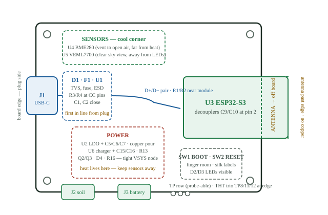

# Layout Readiness & Placement Guide

ESP32-S3 Plant Monitor — Rev A  ·  footprint verification against datasheets + placement playbook  ·  reviewed 2026-08-02 from the saved KiCad files (post-F8 board, 69 footprints, no placement yet)

**Verdict: clear to start layout.** Every footprint on the board was measured pad-by-pad and compared against the land pattern in its datasheet, and every pad→pin→net assignment was re-checked from the board file. All six of my custom footprints match their datasheet drawings to within 0.01 mm. No blocking problems were found. There are a handful of small housekeeping items (Section 2) worth doing in my first ten minutes — the biggest is a duplicated library entry and finishing the board-setup rules — then I can place parts with confidence.

**Contents**  
[1 · Footprint verification results](#footprint-verification-results)  
[2 · Small fixes before I start](#small-fixes-before-i-start-10-minutes)  
[3 · Suggested floorplan](#suggested-floorplan)  
[4 · Placement guide, part by part](#placement-guide-part-by-part)  
[5 · Routing rules for this board](#routing-rules-for-this-board)  
[6 · My first hour of layout, in order](#my-first-hour-of-layout-in-order)  
[7 · Before I order](#before-i-order)  
[8 · What was checked, and how](#what-was-checked-and-how)

## Footprint verification results

A **land pattern** is the manufacturer's recommended copper pad arrangement for a part. Below, "measured" is what is actually in my KiCad libraries and board file; "datasheet" is the recommended pattern from the PDF in `references/datasheets/`. Center-to-center = distance between pad centers. All numbers in mm.

### My six custom footprints (the ones I edited)

| Part                                                          | Footprint                             | Measured                                                                                                                                                       | Datasheet says                                                                                                         | Result                         |
|---------------------------------------------------------------|---------------------------------------|----------------------------------------------------------------------------------------------------------------------------------------------------------------|------------------------------------------------------------------------------------------------------------------------|--------------------------------|
| **J1** — USB-C receptacle · HRO TYPE-C-31-M-12 (C165948)      | `USB_C_Receptacle_HRO_TYPE-C-31-M-12` | 8 signal pads 0.3×1.45 @ 0.5 pitch · 4 power/GND pads 0.6×1.45 · VBUS c-c 4.90 · GND c-c 6.50 · peg holes Ø0.65 @ 5.78 · shield slots 0.6×1.7 / 0.6×1.4 @ 8.64 | 8 × 0.30 @ 0.50 pitch ✓ · 4 × 0.60 ✓ · VBUS c-c 4.80 · GND c-c 6.40 · pegs Ø0.60 @ 5.78 ✓ · slots 1.70 / 1.40 @ 8.65 ✓ | MATCHES · two 0.05 notes below |
| **SW1, SW2** — buttons · XKB TS-1187A (C318884)               | `SW-SMD_4P-L5.1-W5.1-P3.70-LS6.5`     | 4 pads 1.0×0.75 · at x=±3.0, y=±1.85 · numbered 1/1 top row, 2/2 bottom row                                                                                    | 7.0 outer / 5.0 inner → ±3.0, 1.0 wide ✓ · pin pitch 3.70 → ±1.85 ✓ · internal pairing: A-B = top, C-D = bottom ✓      | MATCHES · PAIRING CORRECT      |
| **U5** — light sensor · Vishay VEML7700-TT (C1850416)         | `SENSOR-SMD_EML7700-TT`               | 4 pads 0.7×1.6 · @ 1.27 pitch (±1.90, ±0.63)                                                                                                                   | "Top view" proposed layout: · 4 × 0.7×1.6 @ 1.27 (±1.905, ±0.635)                                                      | MATCHES · 5 µm rounding only   |
| **D4** — Schottky diode · SS14, SMA package (C2480)           | `D_SMA`                               | 2 pads 1.52×1.68 @ ±1.97 · span 5.46 · gap 2.42                                                                                                                | B=1.52, A=1.68, C(c-c)=3.93 · E(span)=5.45 · D(gap)=2.41                                                               | EXACT                          |
| **D1** — TVS diode · SMF5.0A, SOD-123FL (C2980403)            | `D_SOD-123F`                          | 2 pads 1.25×1.5 @ ±1.63 · span 4.51 · gap 2.01                                                                                                                 | X=1.25, Y=1.50, C(c-c)=3.25 · X1(span)=4.50 · G(gap)=2.00                                                              | EXACT                          |
| **F1** — resettable fuse · Littelfuse 1206L075/16WR (C371166) | `Fuse_1206_3216Metric`                | 2 pads 1.0×1.8 @ ±1.40 · gap 1.80                                                                                                                              | pads 1.00 × 1.80, gap 1.80 · (part body 3.0–3.4 × 1.5–1.8 fits)                                                        | EXACT                          |

**The two 0.05-mm notes on the USB-C** (worth understanding, not worth fixing): (1) my VBUS and GND pads sit at ±2.45 / ±3.25 where HRO's drawing says ±2.40 / ±3.20 — a 0.05 mm outward shift inherited from the KiCad library. The connector's legs are ~0.3 mm wide landing on 0.6 mm pads, so they are still fully covered with margin, and the drawing itself declares "tolerance for PCB layout is ±0.05." (2) My pad length is 1.45 vs the drawing's ~1.6 — the pad toe simply ends a hair earlier; this exact geometry ships on thousands of JLC-assembled boards. Both are textbook examples of acceptable leeway.

### Stock KiCad footprints (checked against the same datasheets)

| Part(s)                                          | Footprint                                                        | Measured vs datasheet                                                                                                                                                                                                                                                                  | Result        |
|--------------------------------------------------|------------------------------------------------------------------|----------------------------------------------------------------------------------------------------------------------------------------------------------------------------------------------------------------------------------------------------------------------------------------|---------------|
| **U3** — ESP32-S3-WROOM-1 · (C2913198)           | `RF_Module:ESP32-S3-WROOM-1`                                     | 40 pads 1.5×0.9 @ 1.27 pitch = Espressif Fig 11-1 exactly. Center thermal pad 3.9×3.9 (Espressif: 3.7×3.7 — KiCad adds 0.2, standard practice), 9 paste windows, 12 Ø0.2 ground vias in-pad (Espressif asks for thermal vias here ✓). Antenna keep-out zone included in the footprint. | MATCHES       |
| **U4** — BME280 · (C92489)                       | `Bosch_LGA-8_2.5x2.5mm_P0.65mm · _ClockwisePinNumbering`         | Pads 0.35×0.5 @ 0.65 pitch, rows ±1.025 = Bosch Fig 21 (0.5×0.35, pitch 0.65, row offset 0.775+0.25) rotated 90°. Clockwise numbering matches Bosch's top view; nets confirm pin 1=GND … 8=VDD.                                                                                        | EXACT         |
| **U2** AP2112K · **U6** MCP73831                 | `SOT-23-5`                                                       | Pitch 0.95 and width 0.6 match both vendors. KiCad's pads are longer toward the part center (1.325 vs vendor 0.8–1.1) — a roomier generic pattern that fully covers the lead feet. Normal and proven; no change.                                                                       | OK — standard |
| **U1** USBLC6-2SC6                               | `SOT-23-6`                                                       | ST asks 0.6 wide, 0.95 pitch, rows 2.30 c-c, 3.50 overall; KiCad gives 0.6 / 0.95 / 2.275 / 3.60. Equivalent.                                                                                                                                                                          | OK — standard |
| **Q1–Q3** AO3401A                                | `SOT-23`                                                         | AOS's datasheet ships no land pattern; KiCad's generic SOT-23 (industry pattern for this JEDEC package) is correct. Pinout 1=G, 2=S, 3=D verified through the netlist for all three.                                                                                                   | OK — standard |
| **J2, J3** — JST PH headers                      | `JST_PH_S3B / S2B-PH-K Horizontal`                               | 2.0 pitch ✓. Holes drill 0.75 for JST's 0.5 mm square posts (diagonal 0.71) — inside JST's 0.7–0.8 window, on the snug side; fine for hand soldering.                                                                                                                                  | OK            |
| **R\*, C\*, D2, D3** — 0603/0805 passives & LEDs | `R_0603 / C_0603 / C_0805 / LED_0603`                            | Standard 1608/2012-metric patterns; correct for the Samsung MLCCs and 0603 LEDs. LED polarity verified in the netlist (pad 1 = cathode: D2 K→GND, D3 K→STAT ✓).                                                                                                                        | OK — standard |
| **TP1–TP12, H1–H4**                              | `TestPoint_Pad_D1.5mm · THTPad_D2.0/1.0 · MountingHole_3.2mm_M3` | As planned: 9 flat pads, 3 through-hole (TP8/11/12 — the UART recovery trio), Ø3.2 unplated M3 holes.                                                                                                                                                                                  | OK            |

### Pad → pin → net double-check

Because a footprint can be dimensionally perfect and still wired wrong, every IC's pads were traced to their nets in the board file and compared against the datasheet pinout: **U1** flow-through ESD routing (connector side pins 1/3, module side 6/4, VBUS on 5) ✓ · **U2** VIN/GND/EN/NC/VOUT ✓ (EN tied to VIN ✓) · **U6** STAT/VSS/VBAT/VDD/PROG ✓ · **Q1/Q2/Q3** gate-source-drain all match the working power-path logic from my July reviews ✓ · **D1** cathode→VBUS, anode→GND (correct clamp direction) ✓ · **D4** anode→+5V_PROT, cathode→VSYS ✓ · **J1** all four GND pins grounded, four VBUS pins tied, CC1/CC2 each with their own 5.1 k pulldown, SBU left open, shield→GND ✓ · **J2** signal/power/ground order matches the DFRobot probe ✓ · **J3** pin 1 = battery +, pin 2 = GND ✓ · **SW1** IO0↔GND, **SW2** EN↔GND ✓. The board's embedded footprint copies are also byte-identical in geometry to my `libs/` versions — my latest edits made it into the board, nothing stale.

## Small fixes before I start (10 minutes)

|      | What                                                                                                                 | Why & how                                                                                                                                                                                                                                                                                                                                                                                                                                                                                                                      |
|------|----------------------------------------------------------------------------------------------------------------------|--------------------------------------------------------------------------------------------------------------------------------------------------------------------------------------------------------------------------------------------------------------------------------------------------------------------------------------------------------------------------------------------------------------------------------------------------------------------------------------------------------------------------------|
| FIX  | **De-duplicate the footprint library table.** `hardware/fp-lib-table` lists `PlantMonitor_JLC` four times.           | Each footprint import appended a fresh entry. Duplicate nicknames cause "duplicate library" warnings and can confuse footprint resolution. Open *Preferences → Manage Footprint Libraries → Project Specific* and delete the three duplicate rows (keep one), or edit the file and keep only one `PlantMonitor_JLC` line plus `logos`. Close KiCad first or expect a reload prompt — there are live `.lck` files, so KiCad is likely open right now.                                                                           |
| FIX  | **Set the board's minimum clearance.** Board Setup → Design Rules → Constraints currently has minimum clearance = 0. | The Default netclass (0.2 mm) governs routing, but the board minimum is the DRC floor for everything else (zones, footprints). Set it to **0.2 mm** to match my plan (JLC's true floor is 0.127). While there, add track width presets `0.2 / 0.25 / 0.3 / 0.5 / 0.8` and via preset `0.6 / 0.3` so they're one click away while routing.                                                                                                                                                                                    |
| FIX  | **Create the net classes I planned.** Only "Default" exists right now.                                             | Board Setup → Net Classes: add **Power** — track 0.5 mm, clearance 0.2 — and assign `USB_VBUS`, `+5V_PROT`, `VSYS`, `VBAT`, `VBAT_RAW`, `+3V3`. Add **USB** — track 0.25, diff-pair width 0.25 / gap 0.2 — for `USB_DP`, `USB_DN`. Now the correct widths happen automatically instead of by memory.                                                                                                                                                                                                                           |
| TIDY | **Three courtyard nits in custom footprints.**                                                                       | A **courtyard** is the invisible "personal space" rectangle DRC uses to stop parts overlapping. On the switch it's drawn at the 5.1×5.1 body only, but the pads span 7.0 — so DRC won't warn if something is placed onto the button's pads. VEML7700's courtyard clips its pad bottoms by 0.34 mm, and D_SOD-123F's pads poke 0.05 mm past. Either stretch the courtyards in the footprint editor (30 s each: cover pads + 0.25 mm) or just eyeball ~1 mm of space around those three parts. Nothing here affects fabrication. |
| KNOW | **C3/C4 (DNP) sit directly on the USB data lines.**                                                                  | They're correctly marked do-not-populate. Know for later: if I ever fit them, 100 nF would kill USB signalling — data-line filter caps are ≤ 47 pF. Treat them as emergency EMI pads only, and when placing, keep their stub off the D+/D− path as short as possible.                                                                                                                                                                                                                                                        |
| KNOW | **The logo footprint isn't on the board.**                                                                           | `logos:muffinByteLogo` exists in my library but wasn't imported (it's not in the schematic — fine). During layout add it with *Place → Footprint*, or skip it.                                                                                                                                                                                                                                                                                                                                                               |

## Suggested floorplan

This is one sensible arrangement that satisfies every constraint at once — antenna off the edge, protection at the connector, sensors away from heat, analog away from USB. Mine doesn't have to match it; use it to sanity-check whatever I draw. A ~52 × 42 mm outline is comfortable for this part count on 2 layers; smaller is possible once I'm happy with the flow.

*Zones, not exact positions. Blue = USB path (enters left, protection immediately, pair runs to the module). Red = power/heat. Green = sensors and connectors. Hatched = antenna keep-out: no copper, traces, or silk on any layer; mounting hardware stays clear of it too.*

## Placement guide, part by part

**Three habits that make all of this easy:** ① Place each chip's decoupling capacitors *with* the chip — chip first, its caps immediately after, before anything else gets that space. A decoupling cap only does its job within a few mm of the pin it serves. ② Think in **current loops**: power flows out and must return through ground right underneath — short loop, quiet board. ③ Rotate parts so traces leave in the direction they need to travel; a good placement nearly routes itself. sheet 02

### J1 — USB-C connector

**Where:** on a board edge, dead center of one side is classic. The metal nose should overhang the edge by ~1 mm so a plug seats fully — per the HRO drawing, the board edge belongs ~1.6 mm in front of the rear shield-slot centers. Set it exactly: select J1, press E, and type the position so the edge lands there, then check side-on in the 3D viewer (Alt-3).

**Why:** recessed connectors don't let the plug latch; too much overhang strains the solder joints. The two Ø0.65 holes are locating pegs — they set alignment, so don't nudge the part off-grid relative to my edge line.

**Watch out:** leave ~10 mm of free space outside the edge for the plug's plastic overmold, and don't put tall parts within ~5 mm of the connector sides. The four shield pads want a solid connection into the ground pour — they take the yank when a cable is pulled. Route nothing on the bottom layer directly under the pad row if I can help it; that area becomes my USB ground reference. sheet 02

### D1 (TVS) · F1 (fuse) · U1 (ESD chip) — the protection cluster

**Where:** immediately behind J1, in the order the electrons arrive: VBUS pin → D1 clamp → F1 fuse → onward as +5V_PROT. U1 sits directly in the D+/D− path between the connector and the module.

**Why:** protection parts only protect what's *behind* them. A surge entering the plug must hit the TVS before anything else, which physically means short, fat copper from the VBUS pads to D1 (0.5 mm+ traces, a few mm long). U1 is a "flow-through" part: pins 1/3 face the connector, pins 6/4 face the module — data enters one side, exits the other, no stubs and no doubling back.

**Watch out:** R3/R4 (the 5.1 k CC pulldowns) belong right at the connector's CC pads with short drops to ground — they're what makes a USB-C charger turn on the 5 V. C1 goes next to U1's VBUS pin. C3/C4 are do-not-populate; give them a home tight against the data path where their stub is a millimetre, not a detour. sheet 02→04

### R1, R2 — the 22 Ω USB series resistors

**Where:** near the *module* end of the data run (close to U3 pins 13/14), not at the connector — my July review flagged this as a layout-time item; now is when it happens.

**Why:** series damping resistors work best close to the signal source — the ESP32 is the transmitter I care about. Keep D+ and D− side-by-side through the resistors with both resistors at the same height, so the pair stays matched.

sheet 03

### U2 — AP2112K 3.3 V regulator

**Where:** in the power zone, roughly between D4/Q3 (its input) and the module (its biggest customer). C5 (10 µF) + C6 (1 µF) at the VIN pin, C7 (1 µF) at VOUT — caps first, millimetres from the pins, each with a ground via right at its ground pad.

**Why:** this little part burns up to ~0.34 W during a long Wi-Fi session — real heat for a SOT-23-5. It sheds heat through its pins into copper: give its GND pin a generous pour (a square centimetre or more if I can) on the top layer, tie it to the bottom-layer ground with 4–6 stitching vias, and let the pour breathe.

**Watch out:** keep U2 (and its warm pour) well away from the BME280 — a couple of degrees of board heat becomes a temperature-reading error. Confirmed requirement from both prior reviews, not optional. Thermocouple-check at bring-up. sheet 07

### U6 (charger) · Q2/Q3 · D4 · R16 — battery & power path

**Where:** cluster them: J3 → Q2 → charger/Q3, with D4 bridging +5V_PROT→VSYS. C15 (4.7 µF) at U6's VDD pin, C16 (4.7 µF) at its VBAT pin, R13 (PROG) short to pin 5 with its far end dropping straight to clean ground. R16 near Q3's gate. Keep the whole VSYS node — D4 cathode, Q3 source, LDO input — physically compact and fat (0.5–0.8 mm).

**Why:** the hand-over between USB and battery lives on these few square centimetres; loose, thin copper here shows up as the brown-out I already engineered against with R16 = 10 k. The charger also dissipates ~0.2 W into a low battery — give its pins copper too. D3 + R12 (charge LED) can trail off toward wherever my LEDs live; STAT is a slow signal and doesn't care.

**Watch out:** J3's silkscreen needs big, unmissable **+** and **−** marks (my own hard rule: meter the pack before it ever touches the board — silk is the second line of defense). Face the connector opening toward the board edge so the battery lead doesn't drape across the board. sheet 04

### U3 — ESP32-S3-WROOM-1 module

**Where:** antenna end hanging past the board edge (Espressif's strongly-recommended option — the footprint's keep-out zone extends off-board), feed point close to the edge. C9 (22 µF) + C10 (100 nF) at pin 2 (3V3) — this is the module's power entrance, treat those two caps as part of the module. R7 + C8 (the EN reset RC) and R6 (IO0 pull-up) close to their pins on the button side.

**Why:** the antenna is the one component I can't fix after fab. No copper, traces, silk, or ground pour under or beside it on *any* layer; no mounting hardware or standoffs in front of it; ≥15 mm from enclosure walls in the final product. Espressif also wants dense ground stitching vias *around* (never inside) the keep-out, and the module's center pad tied down with its ground vias — the footprint already carries 12.

**Watch out:** keep the UART recovery test points (TP11/TP12) and USB traces away from the antenna end — Espressif calls this out explicitly. Anything that leaves the board (probe cable, battery leads) should exit the *opposite* side from the antenna. sheet 05

### U4 — BME280 temperature / humidity / pressure

**Where:** the coolest corner I have — far from U2, U6, and the module; near a board edge with its metal-lid vent hole open to the air. C11 + C12 (100 nF each) at VDD and VDDIO.

**Why:** it measures *air*, but it sits in a bath of *board* heat; every degree the copper under it warms up is a degree of error and a few % RH of error. Distance plus thin connecting copper is the whole game (Rev B can add slots around it; for Rev A, corner placement is enough).

**Watch out:** never put silkscreen ink or the sensor's vent under another part, and don't wash the board's conformal-coat over it later. Route only its own I2C + power underneath — no warm power trunks below the sensor. sheet 05

### U5 — VEML7700 light sensor

**Where:** top side with an unobstructed view of the sky: no tall neighbours (connectors, module, buttons) shadowing it, and away from D2/D3 so the power/charge LEDs don't leak light into the reading. C13 (100 nF) at VDD.

**Watch out:** in the enclosure, this part needs a window or light pipe directly above it — decide its position together with the case, not after. Keep white silkscreen away from its immediate surroundings to reduce reflections. sheet 06

### J2, Q1, R10/R11, C14 — soil probe input

**Where:** J2 on the bottom/left edge (away from the antenna). Q1 with R10 near the 3V3 side it switches; **C14 goes at the *module's* GPIO1 pin — not at J2**, and R11 rides along with it.

CORRECTED 2026-08-08 These two are **not** "the ADC filter" as a pair — nothing here is in series with the signal, so there is no on-board RC low-pass on ADC_SOIL. They are two parts with two different jobs:

**R11 (100 k) is a pull-down.** When the probe is switched off (SENS_PWR_EN high → Q1 off) or the cable is unplugged, nothing drives ADC_SOIL; without R11 the pin floats and reads noise. R11 holds it at a defined ~0 V, and is weak enough not to load the probe when the probe *is* driving. This is a DC job — **its position is electrically free**; it sits with C14 for tidiness and a shared ground via.

**C14 (100 nF) is the ADC input cap, and its position is not free.** The ESP32's SAR converter doesn't "look at" the voltage — it samples by charging a small internal capacitor (~10 pF) from the pin, so a reading really does draw a brief gulp of charge. C14 at the pin is the local tank that supplies that gulp instantly, and because it is ~10 000× larger than the internal cap it gives up only ~0.01 % of its own voltage doing so (≈0.15 mV — under a fifth of one LSB), refilling from the probe between readings. It also shunts pickup from the on-board trace, which a cap sited back at J2 could not do.

**Why the rest of the rule:** ADC_SOIL is my highest-impedance, most-precious analog signal. Short trace, no neighbours: keep it away from the USB pair, the antenna, and the power zone. Ground pour alongside is good company for it.

**Watch out:** connector pin order is signal / power / ground (matches the DFRobot cable) — the silk should label pin 1, and my bring-up ritual buzzes the cable anyway. **BAT_SENSE (R14/R15 + C17) is the case where "filter" is literally correct:** R14 is in series, so the divider's Thévenin impedance (R14‖R15 = 50 k) against C17 is a real RC low-pass, corner ≈32 Hz. That 50 k is also why C17 *must* be at the pin — a 50 k source is far too weak to fill the ADC's sampling cap in time by itself. Divider near the module pin, short run into GPIO2, away from noisy copper. sheet 04

### SW1 (BOOT) · SW2 (RESET) — buttons

**Where:** a reachable edge, side by side, same orientation, ~8–10 mm apart so two fingers fit. Silk labels **BOOT** and **RESET** (SW1 = BOOT, SW2 = RESET — schematic wins over the old design doc, as my status file records).

**Why:** I verified the tricky part already — the footprint's 1/1/2/2 numbering matches the switch's internal A-B (top) / C-D (bottom) pairing, re-checked against the XKB drawing. The legs exit left and right; give them ~1 mm of clear space (the courtyard nit from Section 2).

sheets 03/07

### D2, D3 — indicator LEDs

**Where:** board edge or top face where they're visible in the enclosure; label **PWR** and **CHG**; away from U5.

**Watch out:** LED footprints are the classic backwards-at-assembly part. The netlist is right (pad 1 = cathode on both); before ordering, open JLC's assembly preview and confirm each LED's polarity dot per Section 7. sheet 08

### TP1–TP12 · H1–H4 — test points and mounting holes

**Where:** flat pads (TP1–TP7, TP9, TP10) anywhere probe-able on the top face — spread near the circuits they measure, ≥2.5 mm apart, silk-labelled. The through-hole trio TP8/TP11/TP12 (GND/TXD0/RXD0 — my UART recovery port) clusters at one edge like a tiny header, far from the antenna. Holes in the four corners; M3 screw heads need ~Ø6 mm of part-free space around each.

**Watch out:** label every TP on silk with its name, not just a number — future-me with a multimeter will be grateful. Don't let a mounting hole (or its metal standoff) sit inside the antenna keep-out.

## Routing rules for this board

- **Ground first, as a plan:** bottom layer stays as unbroken ground as possible; route on top, drop to bottom only when stuck, and never carve long bottom-layer trenches through the USB or power areas. After routing, pour ground on both layers and stitch them with vias every ~5 mm and at every decoupling cap.
- **Track widths:** power nets (VBUS, +5V_PROT, VSYS, VBAT, VBAT_RAW, +3V3) ≥ 0.5 mm — the net classes from Section 2 handle it. Signals 0.2–0.25 mm. Wider is free; use 0.8 mm on short fat power hops if it fits.
- **USB pair:** D+/D− side-by-side, ~0.2 mm apart, matched in length (within a millimetre is plenty at full speed), zero vias, solid ground underneath the whole run, other signals kept ≥ 0.5 mm away. A 2-layer board can't hit the textbook 90 Ω — "short, coupled, clean reference" is the accepted 2-layer compensation and full-speed USB tolerates it well.
- **Analog (ADC_SOIL, BAT_SENSE):** short, guarded by ground, nowhere near the USB pair, the antenna, or under the module.
- **I2C (SCL/SDA):** route as a pair; relaxed otherwise. The single pull-up pair R8/R9 can live anywhere along the bus.
- **Antenna:** the keep-out is absolute — all layers, copper/traces/silk. Stitch ground generously *around* it, never inside it.
- **Thermals:** U2's pour (Section 4). Zone-to-pad connections: the module's big pad and vias are already set to solid connect in the footprint; leave default thermal reliefs on hand-solderable parts (J2/J3, THT test points) so they stay solderable.
- **Silkscreen pass at the end:** readable reference designators (rotate them, don't delete), polarity marks on D1/D4/D2/D3/J3, pin-1 marks on J2/J3, BOOT/RESET, TP names, and the +/− battery marks. Silk never over pads or the BME280 vent.

## My first hour of layout, in order

1.  **Housekeeping:** the three FIX items from Section 2 (library table, minimum clearance, net classes). Re-run ERC once; it was clean at last save and should stay clean.
2.  **Draw a generous outline** on Edge.Cuts (~52 × 42 mm, 1–2 mm corner radius). I can shrink it at the end — boards grow badly but shrink well.
3.  **Lock the two edge-committed parts:** J1 at its edge with the ~1 mm nose overhang; U3 with the antenna past the opposite (or a side) edge. Press L to lock both so I can't nudge them accidentally.
4.  **Place the chains, not the parts:** protection cluster behind J1 → power zone (LDO + charger + FETs + D4) → module decouplers at pin 2 → sensor corner → connectors on the quiet edges → buttons/LEDs → test points last. Every IC brings its capacitors with it before I move on.
5.  **Stare before routing:** ratsnest lines should look combed, not knotted. Untangle by rotating parts (R), not by planning heroic traces.
6.  **Route in priority order:** USB pair first (it has the least freedom), then power spine (VBUS→F1→D4/charger→VSYS→LDO→3V3 trunk), then analog, then everything else.
7.  **Pour ground both layers, stitch, then DRC** with the JLC-shaped rules. Fix, re-pour, repeat until clean.
8.  **3D-view sanity pass** (Alt-3): connector overhang, button reachability, nothing tall by the USB plug, antenna truly clear.

## Before I order

- Re-run **ERC and DRC** after the final save; both must be clean (or every waiver understood and written down).
- In the JLC/kicad-jlcpcb-tools preview, check **rotation and polarity of every polarized part**: D1, D4, D2, D3, U1–U6, J1, SW1/SW2. JLC's part rotations sometimes differ from KiCad's by 90°/180° — the preview render is the truth. LEDs are the classic victim.
- Confirm **C3/C4 stay DNP** (off the BOM and placement file) and the 12 TPs + 4 holes are excluded as intended.
- **Re-verify stock and Basic/Extended status** at upload (my BOM notes the 10 k alternate C98220). Library status is a live value.
- Freeze the ordered files into `fabrication/revA/` per my README, and push the git commits — PROJECT_STATUS still lists the milestone commit as unpushed.

## What was checked, and how

Parsed from disk (not screenshots): all 8 schematic sheets, `ESP32S3_PlantMonitor.kicad_pcb` (post-F8: 69 footprints, 228 pads, nets assigned, no tracks/outline yet), `ESP32S3_PlantMonitor.kicad_pro` (rules & classes), `fp-lib-table`, and all six `PlantMonitor_JLC.pretty` footprints (confirmed byte-equivalent in geometry to the copies embedded in the board — no stale imports). Datasheets measured: HRO TYPE-C-31-M-12 footprint drawing · XKB TS-1187A drawing (pad layout + internal pairing) · Vishay VEML7700 Rev 1.8 p.10 · MDD SS12–SS1200 p.3 (SMA pads) · Goodwork SMF series p.5 (SOD-123FL pads) · Littelfuse 1206L p.4 · Microchip MCP73831 p.24 (OT land pattern) · Diodes AP2112 p.14 (SOT-25) · ST USBLC6-2 p.13 (Fig 19) · Bosch BME280 Rev 1.24 pp.42–43 (Fig 21) · Espressif ESP32-S3-WROOM-1 v1.8 pp.42–45 (Fig 10-1/11-1) · Espressif Hardware Design Guidelines §1.4.7–1.4.8 (module placement, antenna keep-out, USB) · JST PH family sheet · AOS AO3401A Rev 3.1 (no land pattern published; generic SOT-23 applies). Pad→net mapping verified for every IC, diode, LED, connector, switch, and FET against datasheet pinouts. Prior project reviews (2026-07-20, 2026-07-22) incorporated, not repeated.

First-PCB project · this document lives at `docs/Layout_Readiness_and_Placement_Guide_RevA.html`.
